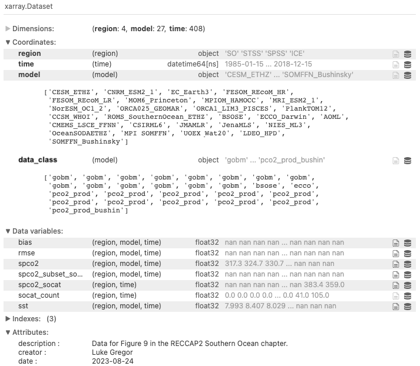

# RECCAP Southern Ocean figures by Luke Gregor

## Figures

- Figure 7: seasonal drivers of $p\mathrm{CO}_2$ (thermal / non-thermal decomposition)
- Figure 9: Comparison of $p\mathrm{CO}_2$ for different data classes with SOCAT
- Figure S11: (see Fig. 7) heatmap of difference between $p\mathrm{CO}_2$ thermal and non-thermal for all data products
- Figure S13: (see Fig. 9) regional and seasonal breakdown of the SOCAT comparison

## Data

The notebook [RECCAP2-SO-monthly-spco2+socat+sst.ipynb](RECCAP2-SO-monthly-spco2+socat+sst.ipynb) can only be run if you have downloaded the full RECCAP2 dataset. The full dataset can be downloaded from [https://doi.org/10.5281/zenodo.7990822](https://doi.org/10.5281/zenodo.7990822).

The notebook creates the netCDF file [RECCAP2-SO-monthly-spco2+socat+sst.nc](RECCAP2-SO-monthly-spco2+socat+sst.nc). This file contains monthly data of the area-weighted averages for the whole SO, STSS, SPSS, and ICE biomes (see [https://reccap2-ocean.github.io/regions/](https://reccap2-ocean.github.io/regions/)).

The file has the following structure:  

## Scripts 

Figures 7 and S11 were created with `RECCAP2-SO-fig07_figS11_plots.ipynb`. And Figures 9 and S13 were created with `RECCAP2-SO-fig09_figS13_plots.ipynb`.

To run these scripts, you must have the required packages installed

## Required packages

### Commonly available

- `numpy`
- `pandas`
- `xarray`
- `seaborn`
- `matplotlib`
- `pyseaflux`  (only for raw data)

### Packages made by Luke

- all_my_code:  
  `%pip install --user git+https://github.com/lukegre/all_my_code/`  
  Gives access to common datasets (SOCAT, RECCAP2 regions) and useful xarray functions. Has more requirements that you'll need to install. See the repo: [https://github.com/lukegre/all_my_code/](https://github.com/lukegre/all_my_code/).
- RECCAP2 scripts  (only for raw data)
  R2-scripts can be found at [https://github.com/RECCAP2-ocean/R2-scripts/](https://github.com/RECCAP2-ocean/R2-scripts/) and contains scripts to read in data easily.
